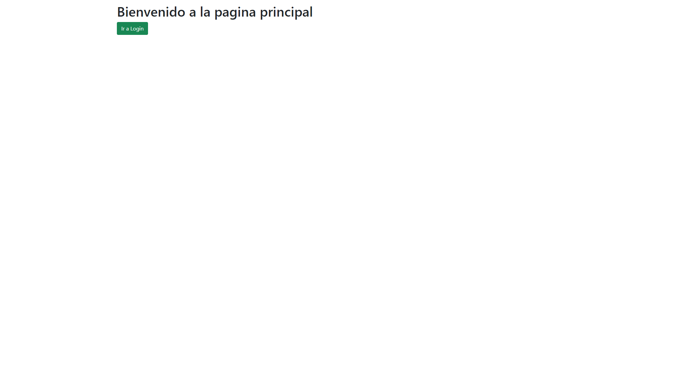
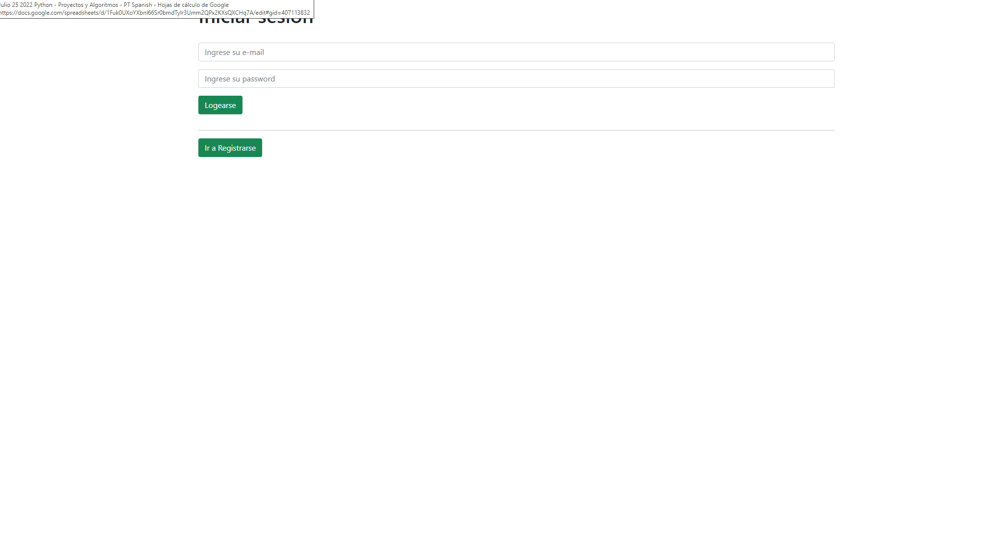
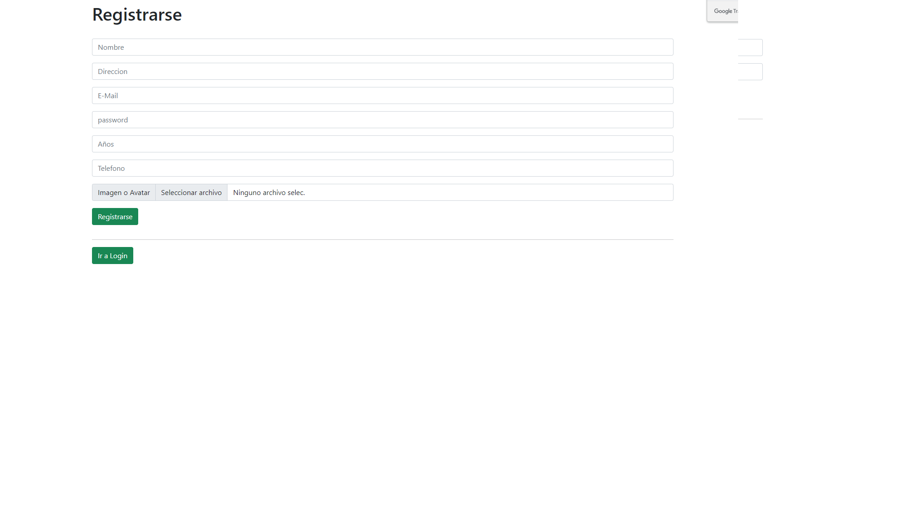
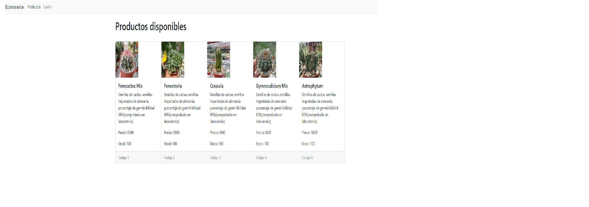
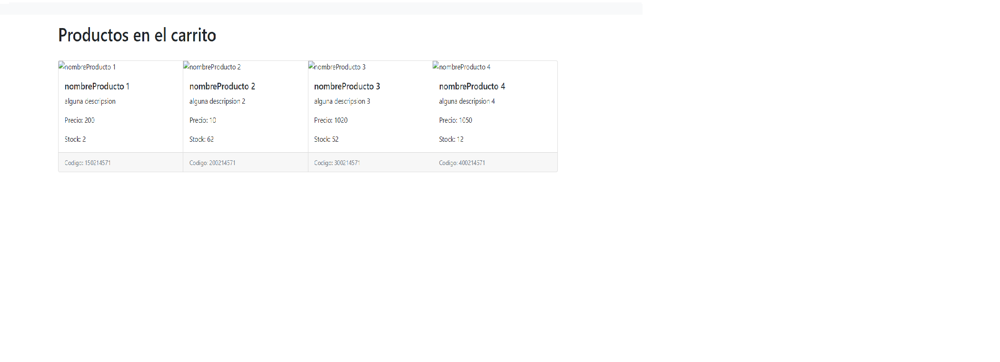
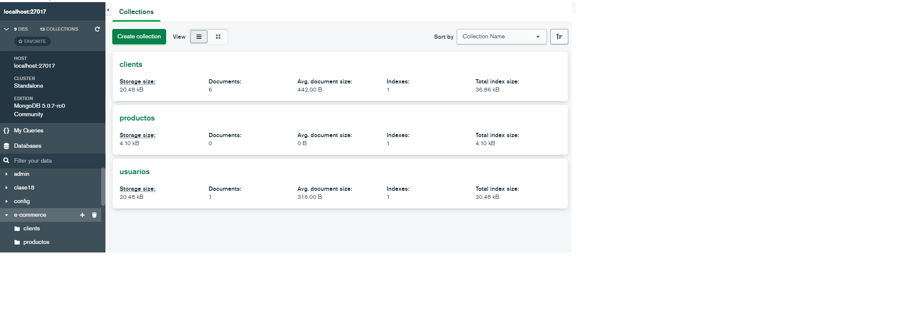

# 🏪 E-comerce Backend 🏪

Proyecto Final de la cursada, Desarrollo Backend Coder Houser Aprobada con exito con nota 9 de 10.

el proyecto consiste en la creacion de una e-commerce, desarrollandola solo con sus pertenecias Backend.

Desarrollar aplicaciones modernas con Node.js y MongoDB - Programar en Javascript del lado del servidor aplicando técnicas asincrónicas.

---
## 👨‍💻 Datos del Creador 👨‍💻

* **Nombre:** Alex Arce
* **Pais:** Chile
* **Docente:** Kevin Joel Oliva Elvir
* **Referencia:** https://www.linkedin.com/in/kevin-joel-oliva-elvir-a1880a164/

## 📁 Datos del proyecto 📁

* **Version de JS:** 😊 ECMA Script 2021

* **Tecnologias Utilizadas:**

  * 😊 axios
  * 😊 body-parser
  * 😊 chai
  * 😊 dotenv
  * 😊 express
  * 😊 express-handlebars
  * 😊 express-session
  * 😊 firebase-admin
  * 😊 fs
  * 😊 jsonwebtoken
  * 😊 mocha
  * 😊 mongoose
  * 😊 multer
  * 😊 socket.io

## 📁 Visualizaciion del proyecto 📁

--> Login

--> Reguistro

--> Productos

--> Productos

--> Carro De compras

--> mongo DB

